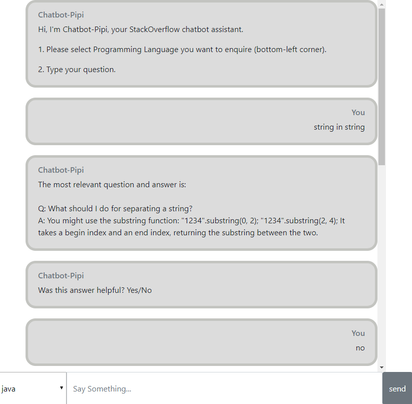
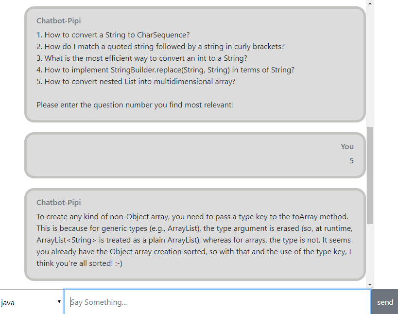
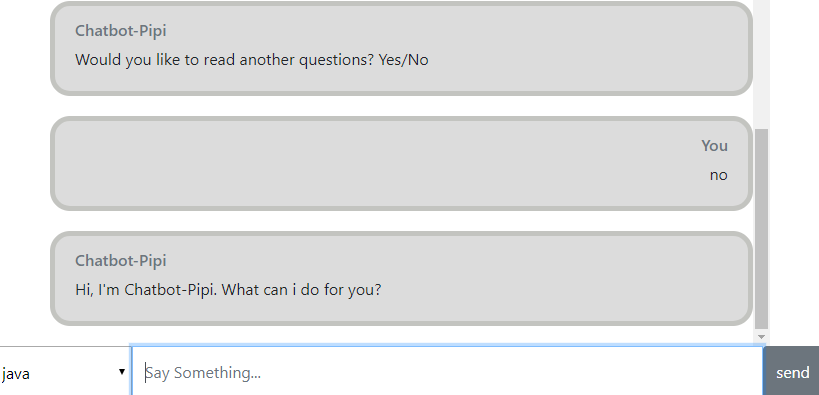
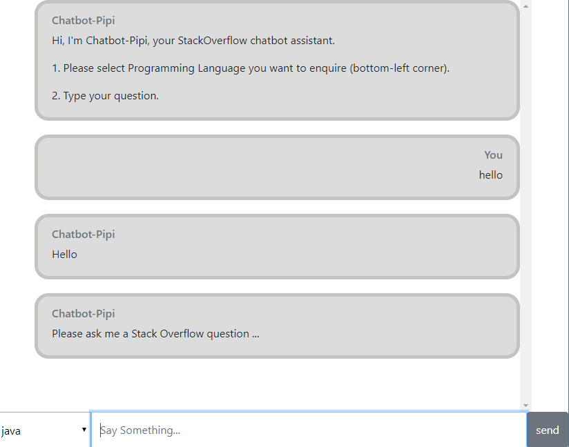

# Retrieval-based Chatbot for Stack Overflow Q&A

A pedagogical chatbot could help people to self-learn coding. 

Points to note:
1. Ensure the CSV file, 'StackOverflow.csv', has been downloaded into the './Data/' folder. The download link is: 
https://www.dropbox.com/s/2vxxxckkfwvfcfq/StackOverflow.csv?dl=0
2. Run the Jupyter Notebook, './Data/StackOverflow_Word2Vec.ipynb', to generate the respective JSON files.
3. Run chatbot.py to start UI.
4. Go to any web browser and type http://localhost:8000/

Amateur coders who are stuck in coding could ask the chatbot for help and directions and the chatbot could return answers that could directly help the users in finding a solution. 

10 major programming languages have been supported in the chatbot, users can ask any questions they have, then try and improve themselves based on the answers, even detail codes from chatbot. 

For user friendliness and convenience, a more concise user interface was developed. All Python codes discussed in the previous section were grouped into a Python class, which are used to process the data and build the models for Word2Vec methods. In addition, JavaScript, HTML and CSS were employed in designing the chatbot user interface. 

First, the user is required to choose their programming language of interest from drop-down menu. The drop-down menu can be found at the bottom left corner of the user interface. Then, the user proceeds to insert their question. Upon clicking on the “Send” button, the Chatbot will retrieve and display the answer, which is selected based on the highest similarity between the question bank and user’s question.

#### If the user is not satisfied with provided answer, the user gets to choose to read either one of the next five most relevant questions.

#### Once the user has read through the other suggested questions and answer, the user can proceed to ask another question or rephrasing their question to get more relevant results.

#### In addition, to improve user experience when interacting with chatbots, simple greetings to the user has be implemented as well.

